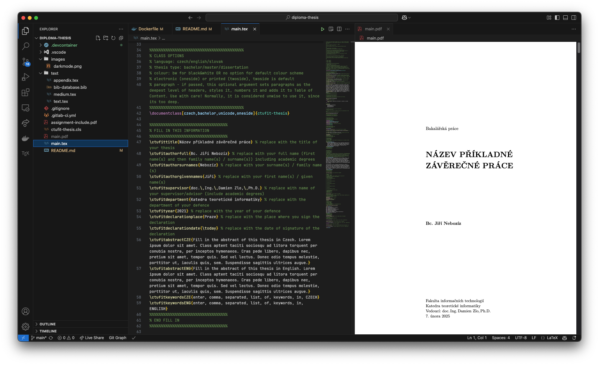

# LaTeX pro VS Code

Tento projekt je základní šablonou pro psaní dokumentů v LaTeXu ve Visual Studio Code, jako může být bakalářská nebo diplomová práce, report nebo semestrákla.

Udělá z tvého VS Code plnohodnotný editor LaTeXu s možností sestavení dokumentu přímo v editoru, aniž bys musel mít nainstalovaný LaTeX na svém počítači.

V moment, kdy si pak nahraješ svůj projekt na univerzitní GitLab, tak se ti sestaví PDF dokument přímo v CI pipeline GitLabu a bude ti k dispozici ke stažení. Budeš mít tak zálohu nejen zdrojových souborů, ale i výsledného PDF dokumentu.

[Na poslední vyrenderovanou FIT šablonu v tomto projektu se můžeš podívat ZDE](../-/jobs/artifacts/main/file/main.pdf?job=latex_render). Tento odkaz bude fungovat i pro tvůj projekt, pokud si ho nahraješ na univerzitní GitLab a použiješ CI pipeline a pojmenuješ svůj hlavní soubor `main.tex`.

Projekt využívá Docker image s minimalistickou instalací LaTeXu, která je dostačující na běžné použití na FITu. Nemusíš tedy stahovat jiné balíčky do svého počítače a nemusíš se bát, že by ti něco nefungovalo kvůli jiné verzi LaTeXu, jinému operačnímu systému, počítači nebo kvůli jiným balíčkům. Zároveň po prvním spuštění můžeš psát i bez internetového připojení.

Dostupný je v základu i ČVUT font Technika, který tedy [nemusíš hledat](https://www.cvut.cz/logo-a-graficky-manual) a instalovat ručně.

## 🛠️ Instalace

Je potřeba mít nainstalovaný [Visual Studio Code](https://code.visualstudio.com) a [Docker](https://www.google.com/search?q=how+to+install+docker).

1. Přihlaš se do univerzitního Docker Container Registry pomocí `docker login gitlab.fit.cvut.cz:5050` ⭐.
2. Nainstaluj si ve VS Code rozšíření [`Dev Containers`](https://marketplace.visualstudio.com/items?itemName=ms-vscode-remote.remote-containers).
3. Stáhni si tento repozitář a otevři si jeho složku ve VS Code 🌟.
4. Otevři tento repozitář v Containeru
    - V pravém dolním rohu by se měla objevit notifikace `Reopen in Container`.
    - Případně obdobně přes modrou ikonu `><` v levém dolním rohu.
5. Počkej na automatické stažení imag (cca 320 MB).
5. Můžeš začít psát!

⭐ respektive pomocí `Login` příkazu v `Deploy -> Container Registry -> CLI Commands`.  
🌟 nebo si ještě lépe tento repozitář forkni a pak naklonuj, můžeš si ho přejmenovat podle svých potřeb.  

## 🚀 Použití

- VS Code dokáže zkompilovat jakýkoliv `.tex` soubor, který je otevřený. Po otevření `.tex` souboru se ti v pravém horním rohu objeví tlačítko s knihou a lupou, které ti zobrazí náhled PDF dokumentu, případně "Play", které ručně vyvolá kompilaci. S každou uloženou úpravou by se měl dokument automaticky překompilovat. Prvotní kompilace může trvat delší dobu, ale další už by měly být výrazně rychlejší.

- `main.tex` je hlavní soubor, který se automaticky renderuje v GitLab CI pipeline. Pokud chceš změnit jméno, kompilovat více rozdílných dokumentů, nebo nějak změnit chování, tak uprav `.gitlab-ci.yml`, jinak stačí upravovat pouze `main.tex` a případně další soubory.

- Pokud při kompilaci proběhnou nějaké chyby, měl by zčervenat či zežloutnot pravděpodobně chybný řádek v kódu a zároveň vyskočit v pravém spodním rohu pop-up s odkazem na log s chybami.

- Image používá LuaLaTeX (viz sekce "FAQ"). Je možné, že některé staré šablony a balíčky nemusí fungovat správně. V takovém případě koukni do sekce "FAQ" a "Jak upravit tento projekt?".

- Formátování LaTeXu je zajištěno skrze `tex-fmt`. Otevřený soubor můžeš formátovat pomocí <kbd>Shift</kbd> + <kbd>Alt</kbd> + <kbd>F</kbd> na Windows, <kbd>Ctrl</kbd> + <kbd>Shift</kbd> + <kbd>I</kbd> na Linuxu a <kbd>Shift</kbd> + <kbd>Option</kbd> + <kbd>F</kbd> na macOS.

## 💻 Funguje to?

Snad ano.

Aktuální image je sestavený pro počítače jak s Intel a AMD procesory, tak pro Apple Silicon.

Testován byl pouze na macOS s Apple Silicon, ale měl by fungovat i na jiných platformách, důkazem jest CI pipeline běžící na Linuxu s x86_64.

Vše bylo testováni jen s novou FIT šablonou, ale mělo by to fungovat snad i s jinými modernímiu šablonami, například PlushCV, pokud nevyžadují nějaké speciální balíčky.

## 📜 Credits

Instalace, respektive `Dockerfile` a `texlive.profile`, vychází z [docker-texlive](https://gitlab.fit.cvut.cz/KAM/docker-texlive) od [@kalvotom](https://gitlab.fit.cvut.cz/users/kalvotom).

Přiložený template vychází z [nové FIT šablony](https://gitlab.fit.cvut.cz/theses-templates/FITthesis-LaTeX) od [@novacto3](https://gitlab.fit.cvut.cz/novacto3).

Za otestování že tohle všde cca jde spustit a že to něco dělá děkuji [Petrovi Šťastnému](https://gitlab.fit.cvut.cz/stastpe8), [Emilovi Poľákovi](https://gitlab.fit.cvut.cz/polakemi) a dalším.

## ❓ FAQ

- Co když mi chybí nějaký Ubuntu balíček?

    - Otevři si soubor `.devcontainer/Dockerfile` a přidej si balíček do `apt-get install` příkazu pod `# EXTRA APT PACKAGES`.
    - Přes `><` ikonu v levém dolním rohu pak stačí zvolit `Rebuild Container`.
    - Koukni dále do sekce "Jak upravit tento projekt?".

- Co když chci nainstalovat nějaký LaTeX balíček?

    - Otevři si soubor `.devcontainer/Dockerfile` a přidej si balíček do `tlmgr install` příkazu pod `# EXTRA TEXLIVE PACKAGES`.
    - Přes `><` ikonu v levém dolním rohu pak stačí zvolit `Rebuild Container`.
    - Koukni dále do sekce "Jak upravit tento projekt?"

- Jak najdu hotový PDF dokument?

    - Náhled PDF je možné zobrazit při editaci `.tex` souborů. Po sestavení dokumentu se vytvoří soubor `main.pdf` ve stejné složce, kde je `main.tex`. V základním nastavení je schovaný, můžeš si ho otevřít pomocí tlačítka pro náhled (kniha s lupou) v pravo nahoře v liště se soubory. Skryté soubory je možné zobrazit odmazáním `"explorer.excludeGitIgnore": true` ve souboru `.vscode/settings.json`.

    - Další možností je otevřít si svůj repozitář na univerzitním GitLabu, proklikat se do `Build -> Pipelines`, rozklidknout ID nejnovější pipeline, otevřít krok `latex_render` a stáhnout si `Job artifacts`, respektive `main.pdf`.

- Která šablona je zde dostupná?

    - Nová FIT šablona dostupná k `2025-02-07 16:17` s commit hash `68675b113cf5c7699b85a993a1e1cbb6c5d1f2a8`, viz [FITthesis-LaTeX](https://gitlab.fit.cvut.cz/theses-templates/FITthesis-LaTeX/-/tree/68675b113cf5c7699b85a993a1e1cbb6c5d1f2a8).

- Jak změním šablonu na novější/starší/úplně jinou?

    - V repozitáři je již připravený template, který můžeš upravovat. Pokud chceš použít jiný, musíš prvně smazat jeho soubory `ctufit-thesis.cls` a `assignment-include.pdf` a složky `text` a `images`. Pak jen stačí `main.tex` upravit tak, jak potřebuješ.

- Co kduž chci použít nějaký vlastní font?

    - Je font dostupný jako balíček v [CTAN](https://ctan.org) repozitáři? Jdi k otázce "Co když chci nainstalovat nějaký LaTeX balíček?".
    - Není dostupný? V takovém případě si ho musíš nainstalovat ručně přidáním do `.devcontainer/fonts` a opětovným sestavením image.
    - Přes `><` ikonu v levém dolním rohu pak stačí zvolit `Rebuild Container`.
    - Koukni dále do sekce "Jak upravit tento projekt?"

- Který typ LaTeXu je nainstalovaný?

    - LuaLaTeX, viz [Dockerfile](.devcontainer/Dockerfile). LuaLaTeX je asi nejmodernější a nejlepší způsob, jak dnes sestavit dokument v LaTeXu.

- Jaká verze LaTeXu je nainstalovaná?

    - Nejnovější dostupná, viz tvůj [Dockerfile](.devcontainer/Dockerfile), respektive dle verze (data YYYYMMDDHHmmss) image v [.gitlab-ci.yml](.gitlab-ci.yml).

- Jaké Ubuntu a LaTeX balíčky jsou nainstalované?

    - Minimum nutné pro novou FIT šablonu, použití GITu a fontů, viz [Dockerfile](.devcontainer/Dockerfile) a [texlive.profile](.devcontainer/texlive.profile).

- Proč používat tohle místo Overleafu nebo LaTeX balíčku co mi nabízí můj OS?

    - ✅ Je to zdarma.
    - ✅ Nejsi omezený na počet projektů.
    - ✅ Nejsi omezený velmi krátkým časem kompilace jako ve free verzi Overleafu.
    - ✅ Od základu funguje již GIT pro verzování.
    - ✅ Rovnou si vše můžeš nahrávat do školního GitLabu, kde se ti díky CI pipeline samo sestaví a uloží PDF s každým commitem.
    - ✅ Kompilace je také lokálně na tvém počítači pravděpodobně rychlejší než na Overleafu.
    - ✅ Od momentu prvního spuštění už nepotřebuješ internetové připojení.
    - ✅ Proti kompletní instalaci LaTeXu je tenhle image naschvál co nejmenší. Zabírá v základu cca 320 MB, instalace `texlive-full` by zabrala přes 6 GB. To proto, že stejně nejspáš nepotřebuješ instalovat balíčky s hieroglyfy, Čínštinou, hudební notací, pro psaní Koránu a další. 
    - ✅ V základu je dostupný i ČVUT font Technika.
    - ❌ Nevýhodou je, že si musíš nainstalovat případně další balíčky, které bys chtěl používat. Většinou by to ale neměla být nutnost.
    - ❌ Dva lidé nemohou tak snadno pracovat live na stejném projektu ve stejný moment. Nejspíš to ale ani nechceš.

- Mám radši WhateverTeX s custom kompilovaným jádrem Linuxu, který je očividně mnohem lepší. Btw používám Nix a Arch Linux.

    - 👍🚿

## 🚧 Jak upravit tento projekt?

Pokud jsi změnil svůj `Dockerfile` nebo nějak jinak svůj image, tak tvá pipeline v GitLab CI nebude fungovat. Pokud CI nepotřebuješ, tak to ignoruj a pouze smaž `.gitlab-ci.yml`. Přijdeš tak ale o všechny výhody CI pipeline, viz "FAQ".

Pokud chceš CI pipeline nadále používat, tak si musíš si vydat vlastní image.

1. Povol si si v GitLabu v nastavení repozitáře vlastní Container Registry `Settings -> General -> Visibility, project features, permissions -> Container Registry`.
2. Přihlaš se pomocí `docker login gitlab.fit.cvut.cz:5050`, respektive `Login` příkazu v `Deploy -> Container Registry -> CLI Commands`.
3. Nahraj nový image do tvého Container Registry dle "Jak vydat nový image?"
4. Uprav `.gitlab-ci.yml` a změň `image` klíč na `image: "${CI_REGISTRY}/TVŮJ_USERNAME/TVŮJ_REPOZITÁŘ:VERZE_IMAGE"`.
5. Uprav `.devcontainer/devcontainer.json` a změň `image` klíč na `"image": "gitlab.fit.cvut.cz:5050/TVŮJ_USERNAME/TVŮJ_REPOZITÁŘ:VERZE_IMAGE"`.
5. Pushni změny do repozitáře a sleduj pipeline.

## 🖼️ Jak vydat nový image?

1. Proveďte změny v tomto repozitáři (mimo Dev Container!).
2. `cd .devcontainer`
3. `export DATENOW=$(date +%Y%m%d%H%M%S)`
4. `docker buildx create --use` - pokud ještě nemáte vytvořený multiplatformní buildx builder
5. `docker build --provenance=false --platform=linux/amd64,linux/arm64/v8 -t "gitlab.fit.cvut.cz:5050/krizant2/thesis-template:$DATENOW" . --push` ⭐
6. `echo "Nová verze je $DATENOW"`
7. Bumpni verze image v `.gitlab-ci.yml` a v `.devcontainer/devcontainer.json`.

⭐ Pokud pracuješ pouze se svým vlasntím repozitářem, nepřispíváš do původního repoyitáře, a jsi si jistý, že budeš pracovat pouze na PC s x86_64 (Intel, AMD) nebo s AMR (Apple Silicon M1, M2, M3, M4, ...), tak můžeš vynechat `linux/arm64/v8` nebo naopak `linux/amd64`. Ušetříš si čas a problémy s crosskompilací mezi platformami.

## 🔍 Troubleshooting

- Nefungují mi citace mimo styly `iso-numeric`, `iso-authoryear` a `ieee`, co s tím?

    - V tomto image jsou nainstalovány pro citační stylyl pouze balíčky `biblatex-iso690` a `biblatex-ieee`. Pokud chceš použít jiný styl citací, musíš si ho nainstalovat ručně. Pokud si myslíš, že by ho měli mít dostupný všichni, pokračuj prosím na sekci "Koho se zeptat?".

- Mám problém pullnout nejnovější image, píše to něco o nedostupném Container Registry.

    - Je možné, že spadnul GitLab 😔. Pokud se ale změnila adresa GitLabu nebo Container Registry, tak je potřeba změnit i adresy v `.gitlab-ci.yml` a `.devcontainer/devcontainer.json`. V době psaní README se používá `gitlab.fit.cvut.cz:5050`. V takovém případě, prosím, pokračuj na sekci "Koho se zeptat?".

## 👀 Koho se zeptat?

Myslíš si že by v základním image (ne)mělo něco chybět? Máš nápad na vylepšení? Napiš mi prosím napiš na Discordu, username `@antoninkriz`, nebo zde vytvoř issue.

Pokud máš problém s LaTeXem, bude lepší volbou [FIT Discord](https://discord.fit.cvut.cz), [TeX Stack Exchange](https://tex.stackexchange.com/) a [Google](https://www.google.com/).
